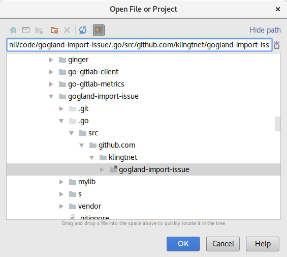
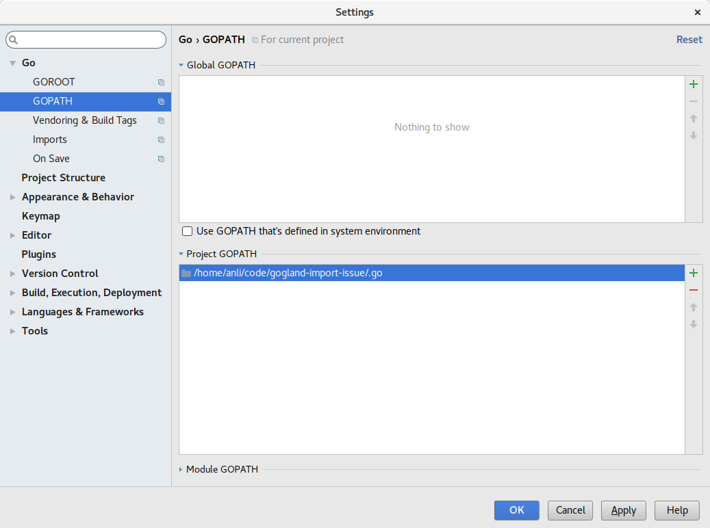
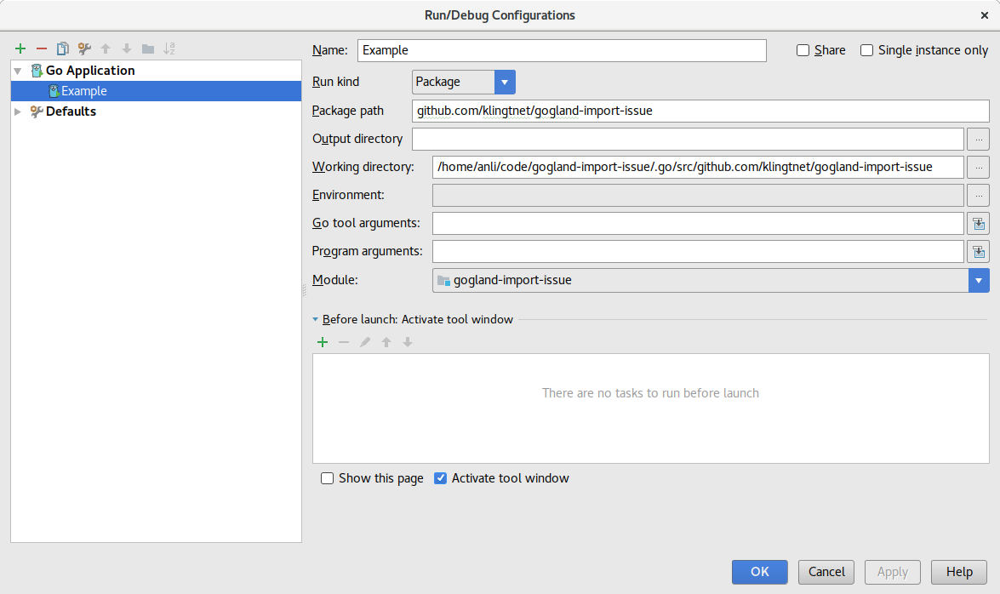

# gogland-import-issue

This project should act as an example for the following import resolution issue [GO-3264](https://youtrack.jetbrains.com/issue/GO-3264#comment=27-1916217).
~~Gogland fails to find imports in a symlinked GOPATH.~~

~~Jetbrains~~@dlsniper reacted with a [tutorial video](https://www.youtube.com/watch?v=XECBbvDT8Ao) on how to setup projects with a recursive `GOPATH`, awesome!
It works flawlessly if you setup the project as explained there or if you follow these steps:

- call `s/bootstrap` (or `make`) to setup the local `GOPATH`

```sh
$ s/bootstrap
Submodule path 'vendor/github.com/sirupsen/logrus': checked out '7f4b1adc791766938c29457bed0703fb9134421a'
linking "/tmp/gogland-import-issue" into local GOPATH: /tmp/gogland-import-issue/.go/src/github.com/klingtnet/gogland-import-issue
```

- open `/project/root/.go/src/github.com/klingtnet/gogland-import-issue` as project in Gogland



- set the projects `GOPATH` to this parent directory `/project/root/.go`



- add a _Go Application_ run configuration for the `github.com/klingtnet/gogland-import-issue` package



That's it, folks!

## Build

`$ make`

Expected output:

```sh
$ make
s/bootstrap
Submodule 'vendor/github.com/sirupsen/logrus' (https://github.com/sirupsen/logrus.git) registered for path 'vendor/github.com/sirupsen/logrus'
Cloning into '/tmp/gogland-import-issue/vendor/github.com/sirupsen/logrus'...
Submodule path 'vendor/github.com/sirupsen/logrus': checked out '7f4b1adc791766938c29457bed0703fb9134421a'
linking "/tmp/gogland-import-issue" into local GOPATH: /tmp/gogland-import-issue/.go/src/github.com/klingtnet/gogland-import-issue
GOPATH=/tmp/gogland-import-issue/.go go build -ldflags="-X main.Version=fba0269" github.com/klingtnet/gogland-import-issue
$ ./gogland-import-issue
WARN[0000] I am printing!

I am printing!
```
